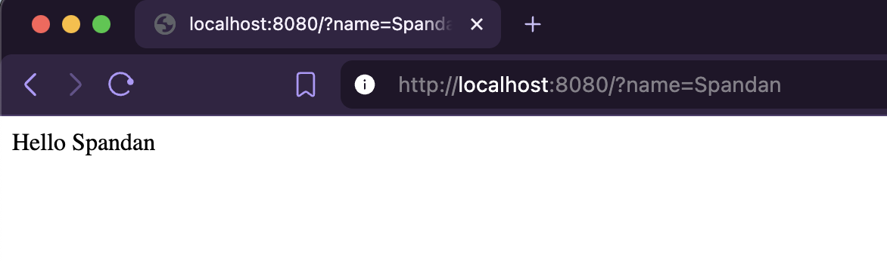
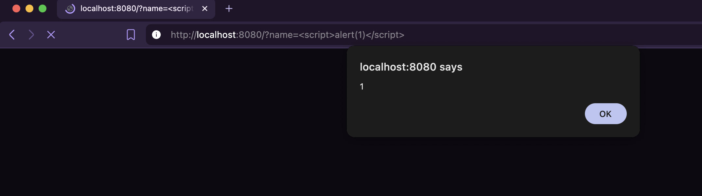
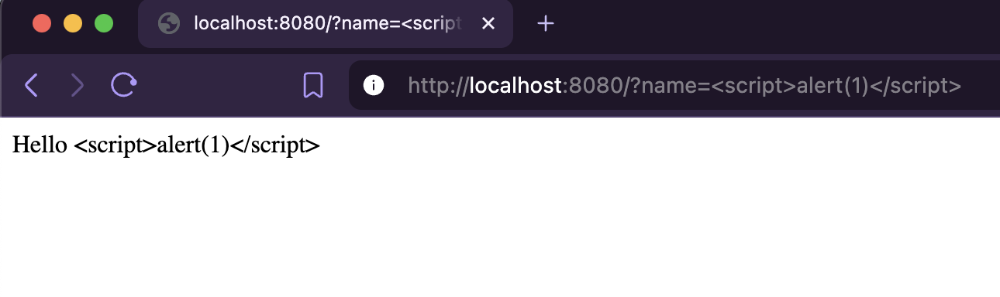

+++
title = "Dissecting CVE-2026-34530: Stored Cross-Site Scripting via text/template branding injection"
date = 2026-09-04
draft = false
author = "Spandan Pokhrel"
description = "A source-code-level breakdown of CVE-2026-34530, exploring a stored Cross-Site Scripting via template injection."

tags = [
  "File Browser",
  "CVE-2026-34530",
  "CVE",
  "Symlink",
  "TUS",
  "File Deletion",
  "Path Traversal",
  "Security Research"
]

categories = [
  "Security Research",
  "CVE Breakdown"
]

[cover]
image = "images/thumbnail.jpg"
alt = "CVE-2026-34530 File Browser vulnerability"
caption = "Dissecting CVE-2026-34530 (img src: acunetix)"
relative = true
+++

> Context: The tool [File Browser](https://github.com/filebrowser/filebrowser?ref=blog.spandanpokhrel.com.np) is [retiring](https://hacdias.com/2026/07/28/filebrowser/?ref=blog.spandanpokhrel.com.np) with the reason that the developers were no longer able to maintain its security or keep up with incoming vulnerabilities. So, I’ve decided to go through every publicly disclosed CVE affecting File Browser and, for each one, start with the original report/title and then trace it back into the source code to understand exactly where and why the vulnerability exists in the simplest way possible.

For this blog, we'll go with `CVE-2026-34530: Stored Cross-Site Scripting via text/template branding injection`.

We have two keyword in the title:
* `Stored Cross-Site Scripting`
* `text/template branding injection`

> The blog assumes you at least have a basic understanding of Cross-Site Scripting. You may learn more about it at [What is cross-site scripting (XSS)?](https://portswigger.net/web-security/cross-site-scripting)

We'll come down to the second keyword: `text/template branding injection`

In Go lang, we have a package `text/template` which is used when we want to create text dynamically by putting variables/data into a predefined template. Eg: 

> the `name` parameter is reflcted into the template `Hello {{.}}`

```go
package main

import (
	"net/http"
	"html/template"
)

func main(){
	t:=template.Must(
		template.New("hello").Parse(
			`
			<html>
				<body>Hello {{.}}</body>
			</html>
			`,
		),
	)
	http.HandleFunc("/", func(w http.ResponseWriter, r *http.Request){
		name:=r.URL.Query().Get("name")
		t.Execute(w, name)
	})
	http.ListenAndServe(":8080", nil)
}
```

The problem is `text/template` (by-default) doesn't HTML-escape template data, meaning if the parameter is attacker controlled, they can simply inject javascript. Eg: 

> `name` parameter is injected with JS `<script>alert(1)</script>`

Coming back to the title, `Stored Cross-Site Scripting via text/template branding injection`, we can actually guess what’s happening here:
1. Code uses `text/template` somewhere, and directy pass it to the template triggering XSS. 

## The vulnerable code:
`http/static.go` in `version <= 2.62.1` uses `text/template`, and passes the `branding.Name` value directly into template without escaping.

```go
// http/static.go, line 33 — branding.Name passed into template data
"Name": d.settings.Branding.Name,
```

Here, `d` is the application's internal data context. `d.settings.Branding.Name` retrieves the configured branding name and stores it in the template data map under the Name key.

The template is then parsed using `text/template`:

```go
// http/static.go, line 97 — template parsed with custom delimiters, no escaping
index := template.Must(template.New("index").Delims("[{[", "]}]").Parse(string(fileContents)))
````

Finally, that data is rendered into the HTTP response:

```go
index.Execute(w, data)
```

And the frontend template (`frontend/public/index.html`) embeds these fields directly:
```html
<!-- frontend/public/index.html, line 16 -->
[{[ if .Name -]}][{[ .Name ]}][{[ else ]}]File Browser[{[ end ]}]
```

As per the [report](https://github.com/filebrowser/filebrowser/security/advisories/GHSA-xfqj-3vmx-63wv), the `branding` name is rendered inside the `<title>` element. Since `text/template` doesn't escape html, a PoC can be: `</title><script>alert(1)</script>`, breaking the `<title>`, and triggering the JS. 

There can be 2 option to fix this: 
* Either use `text/template` + `html.EscapeString(userInput)` to escape the HTML
* Or, directly use `html/template` instead of `text/template`. 
Eg: 
```go
package main

import (
	"net/http"
	"html/template"
)

func main(){
	t:=template.Must(
		template.New("hello").Parse(
			`
			<html>
				<body>Hello {{.}}</body>
			</html>
			`,
		),
	)
	http.HandleFunc("/", func(w http.ResponseWriter, r *http.Request){
		name:=r.URL.Query().Get("name")
		t.Execute(w, name)
	})
	http.ListenAndServe(":8080", nil)
}
```


The FileBrowser team has used the `html/template` option to fix the vulnerability, as it's more context awareness rather than simply, "HTML escape everything".

For example: 
* `<div>{{.Name}}</div>` requires HTML escape. 
* But, `<a href="{{.URL}}">Link</a>` has a URL context, which has a different security requirement. 

So, `html/template` handles everything on it's own, making it much more easier. 

Ref: https://github.com/filebrowser/filebrowser/commit/d9f9460c1e51d10a25065e10358c12d5ced66ad9
