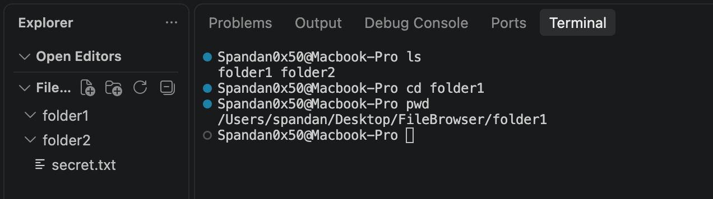
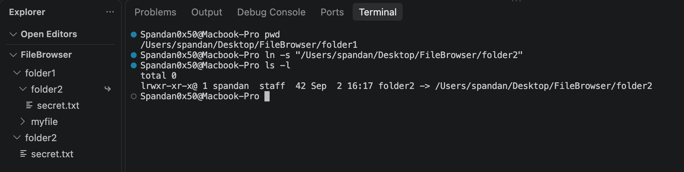
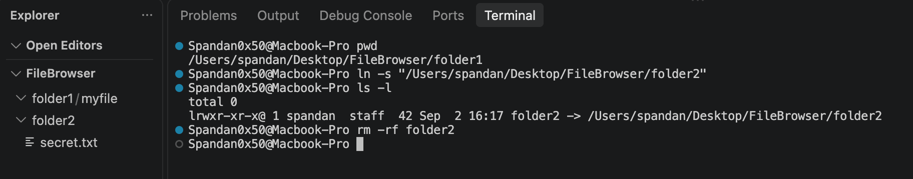

+++
title = "Dissecting CVE-2026-73613: Out-of-scope file deletion via symlink-following delete in TUS upload-cache eviction"
date = 2026-09-03
draft = false
author = "Spandan Pokhrel"
description = "A source-code-level breakdown of CVE-2026-73613, exploring out-of-scope file deletion, symlinks, and TUS upload-cache eviction in File Browser."

tags = [
  "File Browser",
  "CVE-2026-73613",
  "CVE",
  "Symlink",
  "TUS",
  "File Deletion",
  "Path Traversal",
  "Security Research"
]

categories = [
  "Security Research",
  "CVE Breakdown"
]

[cover]
image = "images/thumbnail.jpeg"
alt = "CVE-2026-73613 File Browser vulnerability"
caption = "Dissecting CVE-2026-73613 (generated using Gemini)"
relative = true
+++

> Context: So apparently, the tool [File Browser](https://github.com/filebrowser/filebrowser?ref=blog.spandanpokhrel.com.np) is [retiring](https://hacdias.com/2026/07/28/filebrowser/?ref=blog.spandanpokhrel.com.np) with the reason that the developers were no longer able to maintain its security or keep up with incoming vulnerabilities. So, I’ve decided to go through every publicly disclosed CVE affecting File Browser and, for each one, start with the original report/title and then trace it back into the source code to understand exactly where and why the vulnerability exists in the simplest way possible.

For this blog, we'll go with `CVE-2026-73613: Out-of-scope file deletion via symlink-following delete in TUS upload-cache eviction`.

We have 3 keywords in the title:

- `Out-of-scope file deletion`
- `symlink`
- `TUS upload-cache eviction`

## 1. Out-of-scope file deletion

This one is pretty simple. Consider the following scenario:



Say I'm currently in `/Users/spandan/Desktop/FileBrowser/folder1`, and have privilege only within `/folder1/*`.

Here, out-of-scope file deletion would simply mean me somehow managing to escape the boundary, go to `FileBrowser/folder2` and delete the file `secret.txt`.

In my case, since I have full privileges on my machine, that's just:

```bash
rm ../folder2/secret.txt
```

But in the File Browser case, we don't have such privileges.

## 2. Symlink

This is very similar to creating a shortcut in Windows, but in a Linux environment. We call it a symbolic link (or symlink).

Consider this:



So within `/Users/spandan/Desktop/FileBrowser/folder1`, I've created a shortcut pointing to `/Users/spandan/Desktop/FileBrowser/folder2` using the `ln -s <path>` command, and you can also see the file `secret.txt` that was inside `/folder2`.

A question that you may be thinking of here is: what if I create a shortcut pointing to a directory that exists but I don't have access to?

It's pretty simple: you can obviously create a shortcut, but you'll get an error if you try to do `cd shortcut`, you won't be allowed to view the files inside it or delete them.

One more point here is: if you're on a machine with full privileges, and create a shortcut, and then do `rm -rf` on the shortcut itself, i.e. `/Users/spandan/Desktop/FileBrowser/folder1/folder2/`, then you'll actually be deleting the shortcut, rather than deleting the original folder `folder2/` or contents inside it.



But if you create a shortcut, say the same example: within `/Users/spandan/Desktop/FileBrowser/folder1/`, you create a folder pointing to `/Users/spandan/Desktop/FileBrowser/folder2/`.

If you then explicitly reference the path as `/Users/spandan/Desktop/FileBrowser/folder1/<symlink>/secret.txt`, you can access it; then you can delete the file inside `folder2`, even though the symlink itself resides within `folder1`.

```go
package main

import (
	"fmt"
	"os"
)

func main() {
	path := "/Users/spandan/Desktop/FileBrowser/folder1/folder2/secret.txt"

	err := os.Remove(path)
	if err != nil {
		fmt.Println(err)
	}

	fmt.Println("Deleted!")
}
```

This deletes the file `/folder2/secret.txt`.

That's a symlink.

## 3. TUS upload-cache eviction
You may have never realized it, but you use this almost every single day. Say you're uploading a 5GB file to an AWS S3 bucket or Google Drive, and halfway through, your internet suddenly goes off. When you come back online, instead of needing to reupload the entire 5GB file from the beginning, you can continue from where you actually left off.

So, how does an AWS bucket work here? You try to upload a 5GB file, the backend looks at the metadata, internally communicates with the bucket using those details, and then the bucket responds with multiple presigned URLs, which the backend gives back to the client. The client then uploads a small chunk of the 5GB file on each presigned URLs.

Say you were on the 43rd chunk and suddenly your internet goes off. You can then resume the upload from the 43rd chunk, and eventually, everything will be merged on the bucket's end.

That's essentially what TUS is: a protocol for resumable uploads.

---

Coming back to the title, `Out-of-scope file deletion via symlink-following delete in TUS upload-cache eviction`, we can actually guess what's happening here:
1. An attacker with low privileges creates a symlink pointing to a file or folder that they don't have access to.
2. Somehow, by using TUS, they are able to force the higher-privileged system to follow the symlink and delete the file pointed to by it, which is obviously outside the attacker's boundary.

## The vulnerable code:

```go title="http/upload_cache_memory.go"
const uploadCacheTTL = 3 * time.Minute
func newMemoryUploadCache() *memoryUploadCache {
	cache := ttlcache.New[string, int64]()
	cache.OnEviction(func(_ context.Context, reason ttlcache.EvictionReason, item *ttlcache.Item[string, int64]) {
		if reason == ttlcache.EvictionReasonExpired {
			fmt.Printf("deleting incomplete upload file: \"%s\"\n", item.Key())
			os.Remove(item.Key())
		}
	})
	go cache.Start()
	return &memoryUploadCache{cache: cache}
}
```

That's the main vulnerable code, but the entire context is: so, there's a function `tusPostHandler()` that processes HTTP upload request and constructs `file` object; `file.RealPath()` gives the corresponding path, and is passed to `cache.Register`, which ends up calling:
```go
func (c *memoryUploadCache) Register(filePath string, fileSize int64) {
	c.cache.Set(filePath, fileSize, uploadCacheTTL)
}
```
Say the filePath is `filebrowser/user/x/upload/test.txt` & `fileSize=12345`, and on top of that, this is a resumable upload as we have `const uploadCacheTTL = 3 * time.Minute`. So the cache is something like: 
```text
┌──────────────────────────────────────────────────┐
│ Cache                                            │
├──────────────────────────────────────────────────┤
│ "/srv/.../test.txt" → 12345                      │
│                                                  │
│ expires in: 3 minutes                            │
└──────────────────────────────────────────────────┘
```
The point is, after the 3-minute TTL expires due to incomplete upload, the server is supposed to delete the incomplete chunks & what makes it vulnerable is
```go
	cache.OnEviction(func(_ context.Context, reason ttlcache.EvictionReason, item *ttlcache.Item[string, int64]) {
		if reason == ttlcache.EvictionReasonExpired {
			fmt.Printf("deleting incomplete upload file: \"%s\"\n", item.Key())
			os.Remove(item.Key())
		}
	})
```
the code simply checks if the TTL has expired, and once it expires, it triggers `OnEviction(...)` which then performs `os.Remove()` on `item.Key()` which is simply `file.RealPath()`, which is the same path that was originally registered. 

So the attack flow here would be: 

```text
Attacker: starts a file upload `POST /attacker/uploads/database.db`
        │
        │  absolute filesystem path is stored in cache i.e., on `file.RealPath()`
        |  TTL 3 minutes starts
        ▼
Attacker drops the full file upload, replaces `/attacker/` with a symlink pointing to `/victim/`
        │
        │ waits for 3 minutes
        ▼
TTL expires, leading to `OnEviction()`
        │
        │ os.Remove(/attacker/uploads/database.db)
        ▼
Kernel follows the symlink on `/attacker/`, and resolves it to `/victim/uploads/database.db`.
```

The automatic deletion is primarily for abandoned/incomplete uploads, however using `os.Remove()` is risky because kernel follows the symlink. 

The vulnerability was patched on version `2.63.19` on `9bd79c3aaeb4a55b0e69cf8976c4a258db2f5e06` commit ID, and they added a scope validation via `return d.user.Fs.Remove(uploadPath)`. So, instead of:
```text
3 minutes later
        |
        ▼
os.Remove("/some/path")
```

it became:
```text
3 minutes later
        |
        ▼
callback()
        |
        ▼
d.user.Fs.Remove(uploadPath)
        |
        ▼
ScopedFs authorization/path validation
        |
        ▼
delete only if still allowed
```

That was `CVE-2026-73613` reported by [manus-use](https://github.com/manus-use). Thank you for reading. 